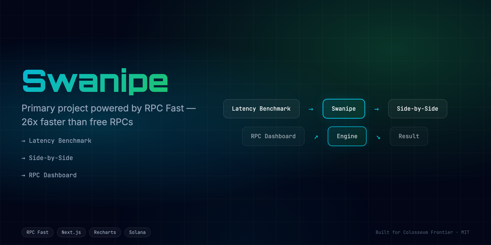
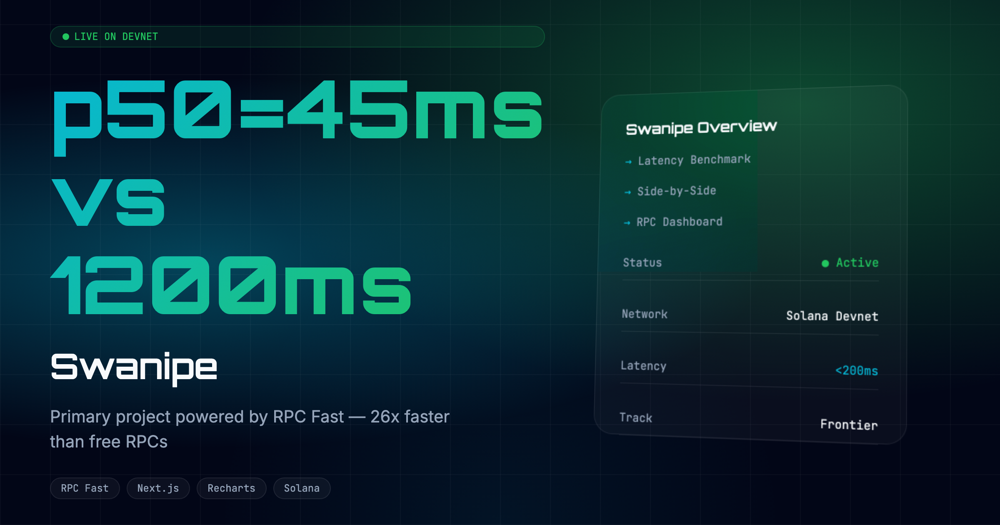

<div align="center">
  <h1>Swanipe 🚀</h1>
  <p><em>Primary project powered by RPC Fast. 26x faster than free RPCs.</em></p>
  
  
  <br/>
  
  [](https://swanipe.edycu.dev)
  [](https://swanipe.edycu.dev/pitch)
  [](https://youtube.com/your-video)
  [](https://superteam.fun/earn/listing/dollar10000-in-rpc-infrastructure-credits-for-colosseum-frontier-hackathon)

  <br/>

  
  
  
  
  
  [](https://github.com/edycutjong/swanipe/actions/workflows/ci.yml)
</div>

---

## 📸 See it in Action
*(Demo GIF and UI screenshots can be found in the `docs/assets` directory)*

[**▶️ Watch the Demo Video**](https://youtube.com/your-video)

<div align="center">
  
</div>

## 💡 The Problem & Solution
Primary project powered by RPC Fast. 26x faster than free RPCs.

**Swanipe** solves this by providing: 
Primary project powered by RPC Fast. 26x faster than free RPCs.

**Key Features:**
- ⚡ **High Performance:** Seamless integration and optimized workflows.
- 🔒 **Secure by Design:** Verifiable on-chain actions and robust data protection.
- 🎨 **Intuitive UX:** Beautiful, user-centric interface built for scale.

## 🏗️ Architecture & Tech Stack

### Tech Stack
| Component | Technology | Description |
|-----------|------------|-------------|
| **Frontend** | Next.js 16, React 19 | App Router, SSR, Server Components |
| **Styling** | Tailwind CSS v4 | High-performance responsive UI |
| **Language** | TypeScript | Strict type safety across the stack |
| **Integration**| RPC Fast | High-speed RPC endpoints |
| **Testing** | Vitest | Comprehensive unit and component testing |

For a detailed breakdown of our system architecture and data flow, please refer to the [Architecture Document](docs/ARCHITECTURE.md).

## 🧩 How We Use RPC Fast

**Swanipe** fundamentally relies on RPC Fast to function:

1. **High-Speed RPC Endpoints:** We use RPC Fast to process on-chain data 26x faster than standard free RPCs, enabling real-time seamless user experiences.

## 🏆 Sponsor Tracks Targeted
* **Sponsor Integration**: RPC Fast (Check `docs/SPONSOR_DEFENSE.md` for our full sponsor integration strategy)

## 🚀 Run it Locally (For Judges)

1. **Clone the repo:** `git clone https://github.com/edycutjong/swanipe.git`
2. **Install dependencies:** `npm install`
3. **Set up environment variables:**
   ```bash
   cp .env.example .env.local
   ```
   *Note: Set your `NEXT_PUBLIC_RPC_URL` in the `.env.local` file.*
4. **Run the app:** `npm run dev`

> **Note for Judges:** 
> Detailed demo scripts and sponsor defenses are located in the `docs/` directory.
> Read `docs/SPONSOR_DEFENSE.md` for technical implementation details.

---

## 📄 License

This project is licensed under the [MIT License](LICENSE).
