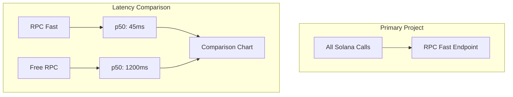

# Swanipe — Technical Architecture

## System Architecture



## Integration (5 min)

```javascript
// Before:
const connection = new Connection("https://api.devnet.solana.com");

// After:
const connection = new Connection(process.env.RPCFAST_URL);
```

## Latency Benchmark

| Metric | RPC Fast | Free RPC | Improvement |
|---|---|---|---|
| p50 | 45ms | 1,200ms | **26.7x** |
| p95 | 120ms | 3,500ms | **29.2x** |
| WebSocket | 30ms | 800ms | **26.7x** |
